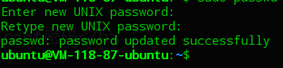
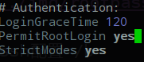

由于腾讯云主机ubuntu系统默认用户名为ubuntu，不喜欢每次做什么都要sudo一下，故设置开启允许root用户登录
方法如下：

<b>1.修改root密码</b>
```
$ ssh ubuntu@[公网ip]
$ sudo passwd root

输入密码(一般和ubuntu密码一样，方便记忆)

```


<b>2.修改ssh配置</b>

```
sudo vim /etc/ssh/sshd_config

```
找到  PermitRootLogin 这项 将其改为 yes



保存退出并重启ssh服务既可。

```
sudo service ssh  restart

```

好了，到这就完成了，下次就可以直接用root用户登陆。
