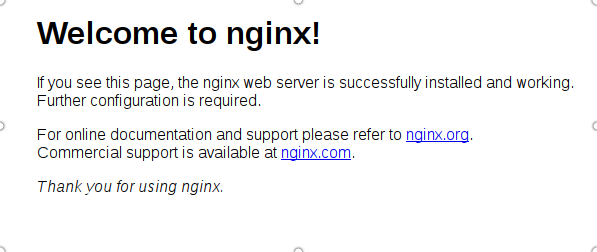

#### 登陆服务器

```
ssh ubuntu@[公网ｉｐ]

```

### 安装

```
sudo apt-get -y install nginx

```
安装完nginx 后　就可以在地址栏输入公网ip就可以看到


代表已经安装成功了　

```
如果在地址栏输入公网ip后无法打开nginx欢迎页面，则很可能是在购买服务器时那个安全组选项选为了
windows安全组方通3389端口了　（改为默认全放通的安全组就可以）

操作方法：云服务器->安全组>默认放通全部端口

```

### 部署自己的网站到nginx

现在在我的开发机上有一个文件夹　strom-site,里面有一个静态网页index.html.
首先我要把这个文件夹传到服务器之上
```
scp -r strom-site ubuntu@123.206.52.223:

```
注意末尾的 <code>:</code> 一定要添加。

接下来，我们跳转到nginx的配置位置，然后化身超级用户：

```
cd /etc/nginx/
sudo su
cd site-enabled/

```
把默认的配置删除
```
rm default

```
然后创建自己的配置文件

```
vim strom.conf

```

strom.conf 内容如下

server {
  listen 80 default;
  root /home/ubuntu/strom-site;
}

配置修改完毕，需要重启 nginx 加载配置，也就是要执行

sudo service nginx reload

这样，到浏览器中就可以通过公网ip看到我们的index.html页面了。
如果这一步失败，可以通过下面的命令来查看具体的报错信息：

nginx -t
